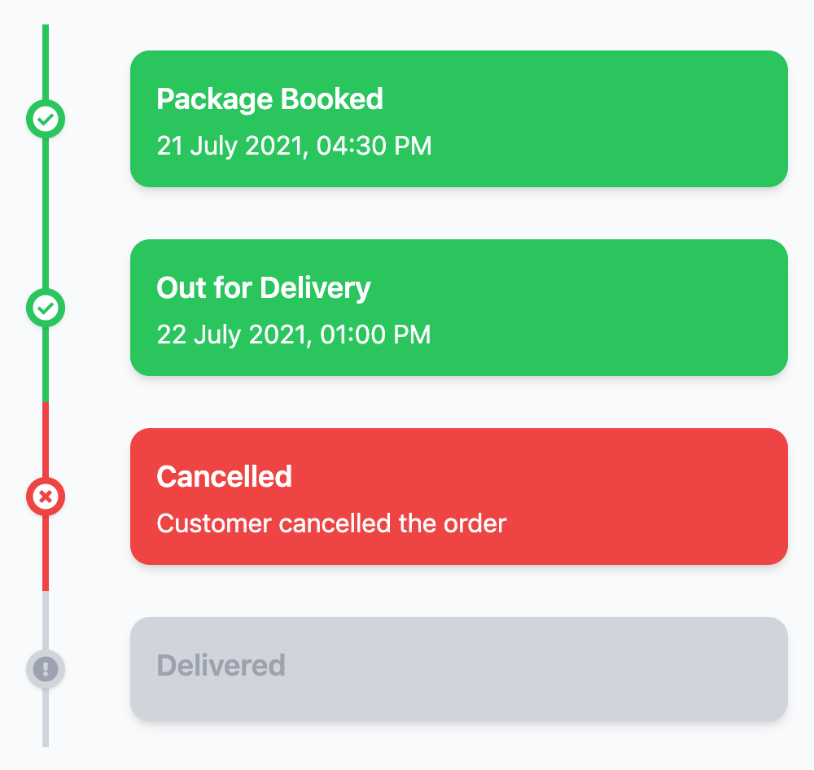

# What
A Svelte Timeline component.
This is what is looks like:



Original Tailwind snippet was from: https://codepen.io/sheikh_ishaan/pen/oNWpgoK

# Use
```bash
npm i svelte-timeline
```
In your route or component,
```
<script>
  import {Timeline} from 'svelte-timeline'
	const events = [
		{
			title: 'Step1',
      date: 'Dec 18, 2021',
      status: 'success'      
    },
    {
			title: 'Step2',
      status: 'error'
    },
    {
			title: 'Step3',
    }
  ]  
<script>

<Timeline {events}/>

```


# Creation steps
This project was created with
```bash
# create a new project in the current directory
npm init svelte@next svelte-timeline
cd svelte-timeline
npx svelte-add@latest tailwindcss
npm install -D svelte2tsx
```

## Developing

To improve this, fork this project.

After you have installed dependencies with `npm install` (or `pnpm install` or `yarn`), start a development server:

```bash
npm run dev

# or start the server and open the app in a new browser tab
npm run dev -- --open
```

## Building npm package

```bash
npx svelte-kit package
```

To test locally without publishing,
```bash
npx svelte-kit package
cd package
npm link
```
Cd to a test project
```bash
npm link svelte-timeline
```
